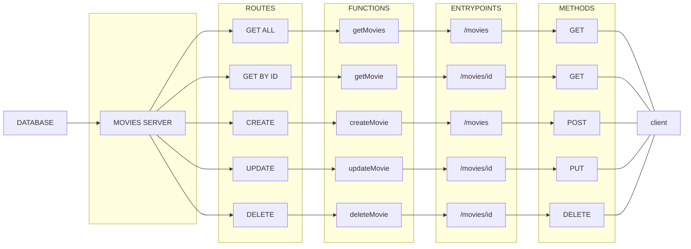

### Simple go http CRUD server



#### Usage:

GET ALL
```
GET http://localhost:8000/movies
```


GET BY ID
```
GET http://localhost:8000/movies/3
```


CREATE
```
POST http://localhost:8000/movies
```
body:
```json
{
    "isbn": "101",
    "title": "Matrix",
    "director": {
        "firstname": "Lana",
        "lastname": "Wachowski"
    }
}
```


UPDATE
```
	PUT http://localhost:8000/movies/8498081
```
body:
```json
{
    "isbn": "789",
    "title": "The Dark Knight",
    "director": {
        "firstname": "Christopher",
        "lastname": "Nolan"
    }
}
```


DELETE
```
DELETE http://localhost:8000/movies/3
```
